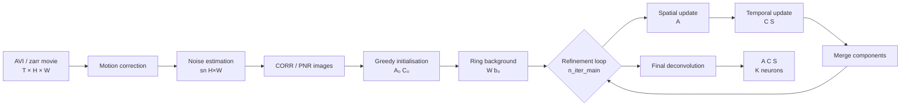

# minicnmfe documentation

> **minicnmfe** — CNMF-E (Constrained Non-negative Matrix Factorization for
> Endoscopic data) for 1-photon miniscope calcium imaging. A clean Python
> reimplementation for extracting neurons from 1-photon calcium-imaging movies.

## Start here

| Page | What's in it |
|------|--------------|
| [Getting started](getting-started/index.md) | Install, quick-start, end-to-end workflow, CLI, troubleshooting |
| [API reference](api/index.md) | Every public function and `CNMFeParams` field — signatures, parameters, returns |
| [Parameter tuning](tuning/index.md) | Automated tuning workflow — one path in, recommended params + figures out |

## Concepts

| Page | What's in it |
|------|--------------|
| [Algorithm (ELI5)](concepts/algorithm-eli5.md) | Plain-English explanation with analogies — no equations |
| [Algorithm (math)](concepts/algorithm-math.md) | Full mathematical derivation of every pipeline step |
| [Architecture](concepts/architecture.md) | Module map, dependency graph, data-flow |
| [Ring background](concepts/ring-background.md) | The ring background model and the sum-to-one constraint |
| [CaImAn comparison](concepts/caiman-comparison.md) | Benchmarking vs CaImAn's CNMF-E — methodology, results, caveats |

## Implementation guides (per stage)

Step-by-step, code-adjacent walkthroughs of each extraction stage — see
[the guides index](guides/index.md):

- [Motion correction](guides/motion-correction.md)
- [Seeds: CORR / PNR images](guides/seeds-corr-pnr.md)
- [Initialization (greedy CORR-PNR)](guides/initialization.md)
- [Background (ring model)](guides/background.md)
- [Spatial update](guides/spatial-update.md)
- [Temporal update](guides/temporal-update.md)
- [Merging](guides/merging.md)
- [Evaluation](guides/evaluation.md)

## Tuning system (per stage)

See [the tuning index](tuning/index.md) and the user-facing
[tuning guide](tuning/guide.md):

- [Heuristics](tuning/heuristics.md)
- [Motion-correction search](tuning/mc-search.md)
- [Extraction sweep](tuning/sweep.md)
- [Quality metrics](tuning/metrics.md)
- [Full-recording validation](tuning/validation.md)

---

## Pipeline at a glance

## Key outputs

| Symbol | Shape | Meaning |
|--------|-------|---------|
| `A` | `(H·W, K)` sparse | Spatial footprints — where each neuron lives (unit-L2-norm; per-component gain lives in the traces) |
| `C` | `(K, T)` | OASIS-deconvolved calcium traces (clean AR(1) shape) |
| `S` | `(K, T)` | Inferred spike trains |
| `C_raw` | `(K_init, T)` | Raw traces from greedy init (pre-deconvolution) |
| `YrA` | `(K, T)` | Residual at each footprint; `C + YrA` is the noisy projected trace |
| `A_norm` | `(K,)` | Original `‖a_k‖₂` before the unit-norm relabeling (load-bearing for the auto-eval) |
| `g` | list of `(p,)` | Per-component AR coefficients used by OASIS |
| `sn_per_k` | `(K,)` | Per-component noise std used by OASIS |
| `W` | `(H·W, H·W)` sparse | Ring background weights |
| `b0` | `(H·W,)` | Per-pixel baseline |
| `sn` | `(H, W)` | Per-pixel noise std |
| `accepted_mask` | `(K,)` bool | Non-destructive auto-eval tag (pixel-count + SNR); components are never dropped |
| `shifts` | `(T, 2)` | Per-frame (dy, dx) motion shifts |
