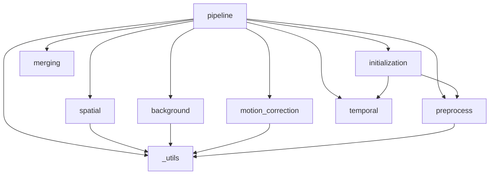

# CNMFe — Architecture & File Map

> See [[api-reference]] for function signatures. See [[usage-guide]] for how to run the pipeline.

---

## Repository Layout

```
D:\code\claude_cnmfe\
├── minicnmfe/                        # Main package
│   ├── __init__.py               # Public re-exports: CNMFe, CNMFeParams, load_movie
│   ├── _utils.py                 # Shared low-level helpers (no algorithm logic)
│   ├── io.py                     # File I/O: AVI/MP4 -> zarr, open/save zarr
│   ├── motion_correction.py      # Rigid motion correction (FFT phase correlation)
│   ├── preprocess.py             # Noise estimation, center-surround PSF, CORR/PNR
│   ├── background.py             # Ring-model background (compute_W, subtract_background)
│   ├── initialization.py         # Greedy CORR-PNR seed detection and extraction
│   ├── spatial.py                # Spatial footprint update (LassoLars per pixel)
│   ├── temporal.py               # Temporal update + OASIS AR deconvolution
│   ├── merging.py                # Component merging (overlap + correlation)
│   ├── concat_avis_to_zarr.py    # Concatenate 0.avi...N.avi into one zarr (importable + `python -m`)
│   └── pipeline.py               # CNMFeParams + CNMFe.fit() orchestrator
├── tests/
│   ├── conftest.py               # make_synthetic_movie() fixture; supports motion_max_shift
│   ├── miniscope_simulator.py    # make_miniscope_movie() realistic simulator; supports motion_max_shift
│   ├── test_io.py
│   ├── test_motion_correction.py
│   ├── test_preprocess.py
│   ├── test_background.py
│   ├── test_initialization.py
│   ├── test_spatial.py
│   ├── test_temporal.py
│   ├── test_pipeline.py
│   └── test_multiprocessing.py   # n_jobs parallelism tests
├── wiki/                         # This documentation
├── demo_movies/                  # Generated AVI + zarr + meta files (created by scripts)
├── generate_demo_movies.py       # Generate demo_movies/*.avi with ground-truth NPZ sidecars
├── convert_to_zarr.py            # Batch-convert demo_movies/*.avi -> *.zarr
├── full_pipeline.py              # CLI: load zarr, run full pipeline, save results to disk
├── tutorial.ipynb                # End-to-end walkthrough notebook
├── tutorial_demo.ipynb           # Realistic lazy-load AVI workflow demo
├── todo/speedup.md               # Guide for future speed improvements
└── pyproject.toml
```

---

## Module Dependency Graph



> [!NOTE]
> `_utils.py` is the only module with no internal imports. All other modules may import from `_utils`. Circular imports are not possible in this layout.

---

## Data Flow

### Types in play

| Variable | dtype | Shape | Where created |
|----------|-------|-------|---------------|
| `movie` / `movie_arr` | float32 | `(T, H, W)` | input |
| `Y_flat` | float32 | `(H·W, T)` | `_utils.make_2d` |
| `sn` | float32 | `(H, W)` | `preprocess.estimate_noise` |
| `sn_flat` | float32 | `(H·W,)` | `.ravel()` of sn |
| `cn`, `pnr` | float32 | `(H, W)` | `preprocess.correlation_pnr` |
| `A` | float32 sparse csc | `(H·W, K)` | `initialization.greedy_corr_pnr` |
| `C` | float32 | `(K, T)` | same |
| `C_raw` | float32 | `(K, T)` | same |
| `g_per_k` | list of `(p,)` arrays | length `K` | `pipeline.fit` (pooled estimate from `C_raw.ravel()`, persisted) |
| `sn_per_k` | float32 | `(K,)` | `pipeline.fit` |
| `W_mat` | float32 sparse csr | `(H·W, H·W)` | `background.compute_W` |
| `b0` | float32 | `(H·W,)` | same |
| `Y_bg` | float32 | `(H·W, T)` | `background.subtract_background` |
| `S` | float32 | `(K, T)` | `temporal.update_temporal` |
| `YrA` | float32 | `(K, T)` | `pipeline.fit` (residual at each footprint after final BCD; `C + YrA` = noisy projection) |
| `shifts` | float32 | `(T, 2)` | `motion_correction.motion_correction_rigid` |

### Pipeline step by step

```
movie_arr (T, H, W)
    │
    ▼ motion_correction_rigid()  (or fit_mc / fused fit_mc_from_avis)
movie_arr (T, H, W)  +  shifts (T, 2)
    │
    ├──► estimate_noise() ──────────────────► sn (H, W)
    │
    ├──► correlation_pnr() ─────────────────► cn (H, W), pnr (H, W)
    │
    ├──► [if decay_time_ms + frame_rate_hz set]
    │     g_target = exp(-1 / (fps · τ_ms / 1000))
    │     (Bayesian prior threaded into every estimate_ar_params call below)
    │
    ├──► greedy_corr_pnr(g_prior=g_target) ─► A (H·W, K), C (K, T), C_raw
    │     (per-component estimate_ar_params inside greedy init also
    │      receives the prior; OASIS deconvolution at each seed runs
    │      against the prior-shrunk g)
    │
    ├──► make_2d() ─────────────────────────► Y_flat (H·W, T)
    │
    ├──► estimate_ar_params(                 ► g_per_k (cached), sn_per_k
    │         C_raw.ravel(),
    │         g_prior=g_target,
    │         g_prior_weight=p.g_prior_weight,
    │     )
    │     g_post = (1 - w) · g_yw + w · g_target  (fudge_factor bypassed
    │     on prior path; legacy multiplicative shrinkage when prior is None)
    │
    ├──► compute_W() ───────────────────────► W_mat (H·W, H·W), b0 (H·W)
    │
    └── for n_iter_main iterations:
            │
            ├──► [iter 0 only]
            │     merge_components() ────────► A, C, members_per_group
            │     _cache_after_merge()      ─► g_per_k, sn_per_k (inherit)
            │
            ├──► subtract_background() ─────► Y_bg (H·W, T)
            ├──► update_spatial() ──────────► A (H·W, K)
            ├──► [prune dead components]   ─► A, C, g_per_k, sn_per_k
            ├──► update_temporal(g_cached=…)─► C, S, g_per_k, sn_per_k (cache reused, no drift)
            ├──► merge_components() ────────► A, C, members_per_group
            ├──► _cache_after_merge()      ─► g_per_k, sn_per_k (inherit from members[0])
            ├──► [if merged] update_temporal()
            └──► compute_W() ────────────────► W_mat, b0  (refresh)
    │
    ├──► update_temporal() (final pass) ────► C, S, g_per_k, sn_per_k
    └──► [compute residual projection]  ────► YrA (K, T) — model.C + model.YrA = noisy projection
```

---

## Parallelism Model

Each step that supports `n_jobs` uses `joblib.Parallel` with the `loky` backend (process-based, Windows-compatible). Worker functions are defined at **module level** to be picklable.

Parallelism is **axis-aligned** — partitioning along frames, flattened pixels, or neurons depending on the step. The full FOV is always processed as one piece; there is no spatial tiling.

| Step | Axis | Worker | Unit of work |
|------|------|--------|--------------|
| `correlation_pnr` (PSF conv) | frames (T) | `scipy.ndimage.convolve` | one frame |
| `greedy_corr_pnr` (PSF conv) | frames (T) | `scipy.ndimage.convolve` | one frame |
| `motion_correction_rigid` | frames (T) | `_filter_estimate_apply` (per batch via `_process_batch`) | one frame |
| `compute_W` (ring background) | pixels (H·W) | `_ring_pixel_batch` | 500 pixels per batch |
| `update_spatial` | pixels (H·W) | `_spatial_pixel_batch` | 256 pixels per batch |
| `update_temporal` (OASIS) | neurons (K) | `_deconvolve_with` | one component |

> [!WARNING]
> On Windows, `n_jobs != 1` uses `spawn` (no fork). Avoid large global state; prefer passing arguments explicitly. The greedy seed loop in `greedy_corr_pnr` is itself sequential — only the per-frame PSF convolution that feeds it is parallel. By default (`init_patches=True`) the FOV is split into overlapping patches run in parallel **processes** (`greedy_corr_pnr_patched`), but each patch's seed loop is still sequential. OASIS is sequential along T per component (cannot be parallelised within a trace), only across K.

### Why axis-aligned and not patch-based (vs CaImAn)

CaImAn's `rf` parallelism splits the FOV into overlapping spatial tiles, runs full CNMF per tile in parallel, then stitches. That scales to FOVs that don't fit in RAM, at the cost of edge artefacts and a stitching/merge step across patch boundaries.

`minicnmfe/` parallelises along T / pixels / K instead. Every step sees the whole FOV, so there is no boundary stitching and no patch-boundary duplicate components — but the in-memory `(T, H, W)` movie is the hard ceiling. Motion correction already streams from zarr; the BCD stages (`update_spatial`, `update_temporal`, `compute_W`) currently require the full movie in RAM. For very large recordings, adding patch-based parallelism or zarr-streamed BCD would be the natural extensions.

---

## Key Design Decisions

### Zarr-native I/O
All input formats are converted to zarr (time-chunked) before processing. The pipeline reads frames in batches without loading the full movie into RAM.

### Flat pixel representation
After initialisation, the movie is stored as `(H·W, T)` — pixels as rows, time as columns. This makes the matrix products $\mathbf{A}\mathbf{C}$ and $\mathbf{A}^\top\mathbf{Y}$ straightforward dense-sparse multiplications.

### No CaImAn imports
All math is reimplemented from scratch using numpy/scipy/skimage/sklearn. CaImAn source is referenced for algorithm design only.

### Module-level worker functions
Functions dispatched by `joblib.Parallel` (e.g. `_filter_estimate_apply`, `_deconvolve_with`) are always defined at the **top level** of their module, not as lambdas or nested functions. This is required for pickling on Windows (`spawn` process start method). `_deconvolve_with` replaced the older `_deconvolve_one` and takes pre-computed `g`/`sn` so it does not re-estimate AR params per call.

### Bayesian-prior path for AR coefficient `g`
`estimate_ar_params` has two shrinkage paths. The legacy path multiplies the Yule-Walker estimate by `fudge_factor` (default `0.96`) — a unitless prior toward zero. The prior path takes `g_prior = exp(-1 / (fps · τ_ms / 1000))` derived from `CNMFeParams.decay_time_ms` + `frame_rate_hz` and shrinks toward it: `g = (1 - g_prior_weight) · g_yw + g_prior_weight · g_prior`. `fudge_factor` is bypassed on the prior path.

`g_target` is computed once in `CNMFe.fit` and threaded into every estimator: pipeline-init pooled estimate, per-component init estimate (greedy `extract_spatial_temporal`), and the `update_temporal` fallback when the cache is empty. With this, the same shrinkage target governs the AR coefficient end-to-end across init → BCD → final pass. See [todo/oasis_oversmoothing.md](../todo/oasis_oversmoothing.md) for the diagnostic that motivated the path.
