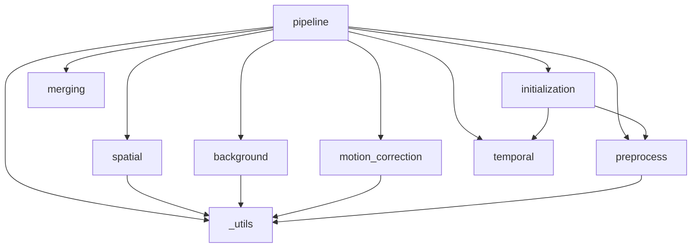

# CNMFe — Architecture & File Map

> See [[api-reference]] for function signatures. See [[usage-guide]] for how to run the pipeline.

---

## Repository Layout

```
D:\code\claude_cnmfe\
├── cnmfe/                        # Main package
│   ├── __init__.py               # Public re-exports: CNMFe, CNMFeParams, load_movie
│   ├── _utils.py                 # Shared low-level helpers (no algorithm logic)
│   ├── io.py                     # File I/O: AVI/MP4 → zarr, open/save zarr
│   ├── motion_correction.py      # Rigid motion correction (FFT phase correlation)
│   ├── preprocess.py             # Noise estimation, center-surround PSF, CORR/PNR
│   ├── background.py             # Ring-model background (compute_W, subtract_background)
│   ├── initialization.py         # Greedy CORR-PNR seed detection and extraction
│   ├── spatial.py                # Spatial footprint update (LassoLars per pixel)
│   ├── temporal.py               # Temporal update + OASIS AR deconvolution
│   ├── merging.py                # Component merging (overlap + correlation)
│   └── pipeline.py               # CNMFeParams + CNMFe.fit() orchestrator
├── tests/
│   ├── conftest.py               # make_synthetic_movie() fixture
│   ├── test_io.py
│   ├── test_motion_correction.py
│   ├── test_preprocess.py
│   ├── test_background.py
│   ├── test_initialization.py
│   ├── test_spatial.py
│   ├── test_temporal.py
│   ├── test_pipeline.py
│   └── test_multiprocessing.py   # n_jobs parallelism tests
├── wiki/                         # This documentation
├── tutorial.ipynb                # End-to-end walkthrough notebook
└── pyproject.toml
```

---

## Module Dependency Graph



> [!NOTE]
> `_utils.py` is the only module with no internal imports. All other modules may import from `_utils`. Circular imports are not possible in this layout.

---

## Data Flow

### Types in play

| Variable | dtype | Shape | Where created |
|----------|-------|-------|---------------|
| `movie` / `movie_arr` | float32 | `(T, H, W)` | input |
| `Y_flat` | float32 | `(H·W, T)` | `_utils.make_2d` |
| `sn` | float32 | `(H, W)` | `preprocess.estimate_noise` |
| `sn_flat` | float32 | `(H·W,)` | `.ravel()` of sn |
| `cn`, `pnr` | float32 | `(H, W)` | `preprocess.correlation_pnr` |
| `A` | float32 sparse csc | `(H·W, K)` | `initialization.greedy_corr_pnr` |
| `C` | float32 | `(K, T)` | same |
| `C_raw` | float32 | `(K, T)` | same |
| `W_mat` | float32 sparse csr | `(H·W, H·W)` | `background.compute_W` |
| `b0` | float32 | `(H·W,)` | same |
| `Y_bg` | float32 | `(H·W, T)` | `background.subtract_background` |
| `S` | float32 | `(K, T)` | `temporal.update_temporal` |
| `shifts` | float32 | `(T, 2)` | `motion_correction.motion_correct` |

### Pipeline step by step

```
movie_arr (T, H, W)
    │
    ▼ motion_correct()
movie_arr (T, H, W)  +  shifts (T, 2)
    │
    ├──► estimate_noise() ──────────────────► sn (H, W)
    │
    ├──► correlation_pnr() ─────────────────► cn (H, W), pnr (H, W)
    │
    ├──► greedy_corr_pnr() ─────────────────► A (H·W, K), C (K, T), C_raw
    │
    ├──► make_2d() ─────────────────────────► Y_flat (H·W, T)
    │
    ├──► compute_W() ───────────────────────► W_mat (H·W, H·W), b0 (H·W)
    │
    └── for n_iter_main iterations:
            │
            ├──► subtract_background() ─────► Y_bg (H·W, T)
            ├──► update_spatial() ──────────► A (H·W, K)
            ├──► update_temporal() ─────────► C (K, T), S (K, T)
            ├──► merge_components() ────────► A, C (fewer K if merged)
            └──► compute_W() ────────────────► W_mat, b0  (refresh)
    │
    └──► update_temporal() (final pass) ────► C, S
```

---

## Parallelism Model

Each step that supports `n_jobs` uses `joblib.Parallel` with the `loky` backend (process-based, Windows-compatible). Worker functions are defined at **module level** to be picklable.

| Function | What is parallelised | Worker |
|----------|---------------------|--------|
| `correlation_pnr` | PSF convolution per frame | `scipy.ndimage.convolve` |
| `motion_correct` | Per-frame shift estimate+apply | `_shift_and_correct_frame` |
| `compute_W` | Ridge regression per pixel batch | `_ring_pixel_batch` |
| `update_spatial` | LassoLars per pixel batch | `_spatial_pixel_batch` |
| `update_temporal` | OASIS deconvolution per component | `_deconvolve_one` |
| `greedy_corr_pnr` | Initial PSF filtering per frame | `scipy.ndimage.convolve` |

> [!WARNING]
> On Windows, `n_jobs != 1` always forks via `spawn` (no fork). Avoid large global state; prefer passing arguments explicitly. The greedy loop itself is always sequential.

---

## Key Design Decisions

### Zarr-native I/O
All input formats are converted to zarr (time-chunked) before processing. The pipeline reads frames in batches without loading the full movie into RAM.

### Flat pixel representation
After initialisation, the movie is stored as `(H·W, T)` — pixels as rows, time as columns. This makes the matrix products $\mathbf{A}\mathbf{C}$ and $\mathbf{A}^\top\mathbf{Y}$ straightforward dense-sparse multiplications.

### No CaImAn imports
All math is reimplemented from scratch using numpy/scipy/skimage/sklearn. CaImAn source is referenced for algorithm design only.

### Module-level worker functions
Functions dispatched by `joblib.Parallel` (e.g. `_shift_and_correct_frame`, `_deconvolve_one`) are always defined at the **top level** of their module, not as lambdas or nested functions. This is required for pickling on Windows (`spawn` process start method).
