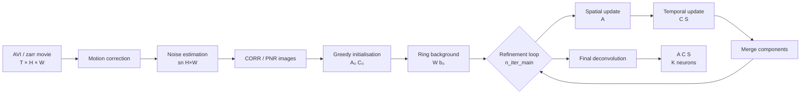

# minicnmfe — Map of Content

> **minicnmfe** — CNMF-E (Constrained Non-negative Matrix Factorization for Endoscopic data) for 1-photon miniscope calcium imaging.
> A clean Python implementation for extracting neurons from 1-photon calcium imaging movies.

## Navigation

| File | What's in it |
|------|-------------|
| [[algorithm-math]] | Full mathematical derivation of every pipeline step |
| [[algorithm-eli5]] | Plain-English explanation with analogies — no equations |
| [[architecture]] | Module map, dependency graph, data-flow diagrams |
| [[api-reference]] | Every public function — signatures, parameters, return values |
| [[usage-guide]] | Quick-start, parameter tuning, parallelism, cookbook |
| [[parameter-tuning]] | Automated tuning workflow — one path in, recommended params + graphs out |
| [[caiman-comparison]] | Benchmarking vs CaImAn's CNMF-E — methodology, results, caveats |

---

## Pipeline at a Glance

---

## Key Outputs

| Symbol | Shape | Meaning |
|--------|-------|---------|
| `A` | `(H·W, K)` sparse | Spatial footprints — where each neuron lives |
| `C` | `(K, T)` | OASIS-deconvolved calcium traces (clean AR(1) shape) |
| `S` | `(K, T)` | Inferred spike trains |
| `C_raw` | `(K_init, T)` | Raw traces from greedy init (pre-deconvolution) |
| `YrA` | `(K, T)` | Residual at each footprint; `C + YrA` is the noisy projected trace |
| `g` | list of `(p,)` | Per-component AR coefficients used by OASIS |
| `sn_per_k` | `(K,)` | Per-component noise std used by OASIS |
| `W` | `(H·W, H·W)` sparse | Ring background weights |
| `b0` | `(H·W,)` | Per-pixel baseline |
| `sn` | `(H, W)` | Per-pixel noise std |
| `shifts` | `(T, 2)` | Per-frame (dy, dx) motion shifts |
